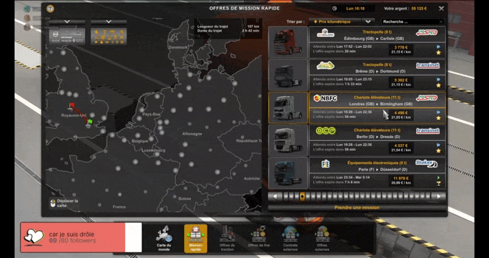

<h1 align="center">
     
    
     
    Twitch Chat Stats
     
</h1>

<h4 align="center">Chrome extension to add new stats panel in twitch.</h4>

    
    
    
    
    

    <a href="https://chrome.google.com/webstore/detail/twitch-chat-stats/cibpobmdeonkgkljhapfjcdcjaomdffn">Add to chrome</a> •
    <a href="#preview">Preview</a> •
    <a href="#features">Features</a> •
    <a href="#license">License</a> •
    <a href="#credits">Credits</a>

## Preview

*Recorded on [twitch.tv/jaklive](https://twitch.tv/jaklive)*

 

## Features

This extension add a new stats panel in Twitch. To open it, just go under `Settings` (on the video player) -> `Advanced` -> `Chat stats`. (see: [preview](#preview))  

This panel contains:
- The amount of messages received per second (average on up to 3 second depending on the flow)
- The amount of messages received during the last 10 seconds

 

## License

This project is <a href="https://opensource.org/licenses/MIT">MIT</a> licensed.

 

## Credits

- Icon: <a href="https://www.flaticon.com/free-icons/chart" title="chart icons">Chart icons created by Freepik - Flaticon</a> (with modified colors)
- README design: <a href="https://github.com/amitmerchant1990/electron-markdownify/blob/master/README.md">github.com/amitmerchant1990</a>